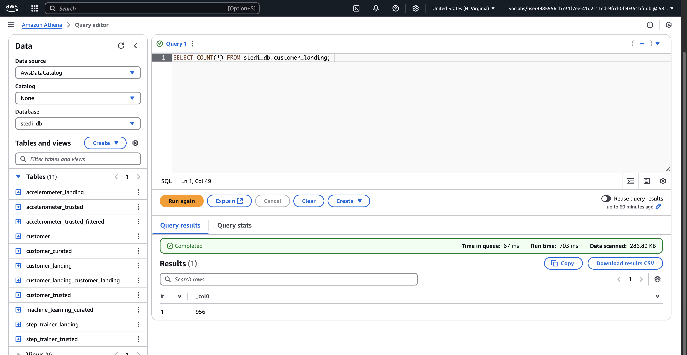
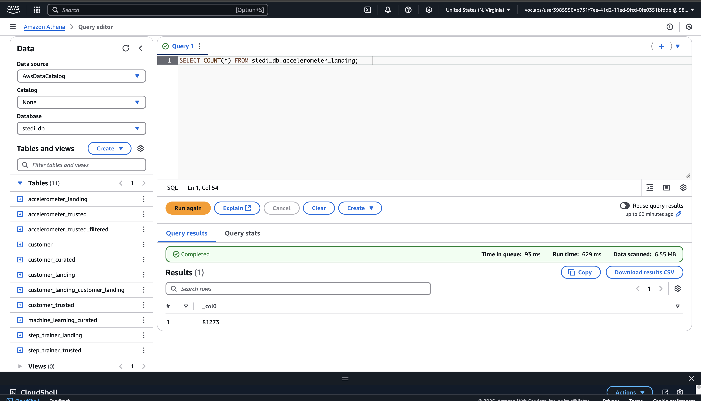
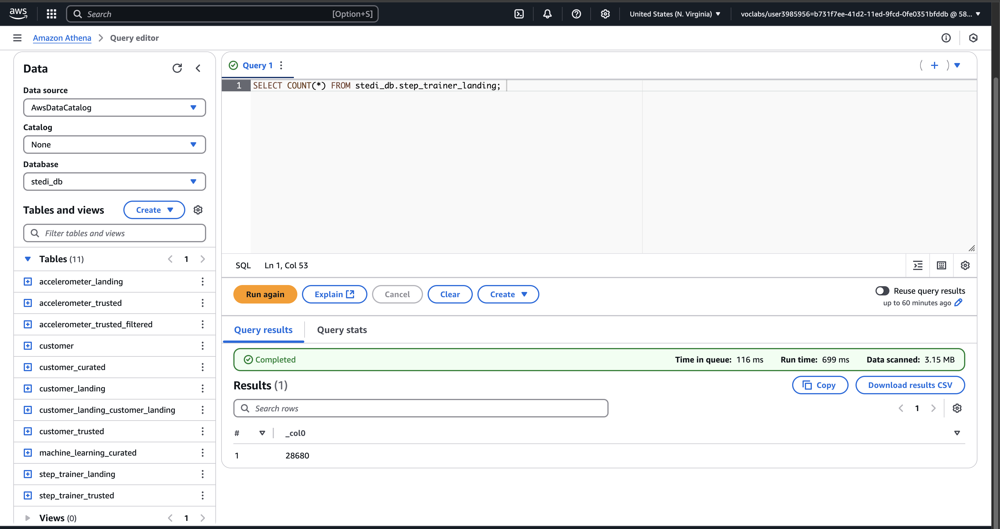
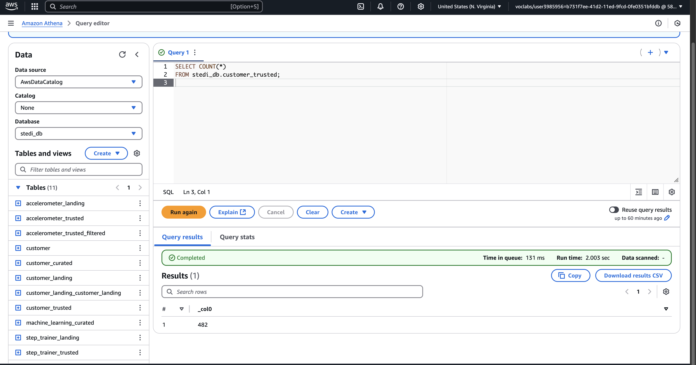
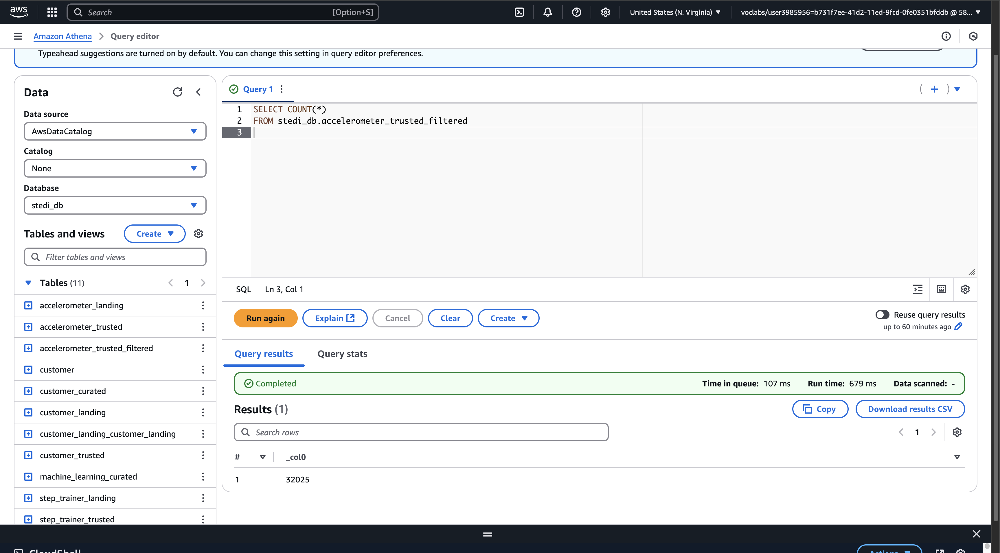
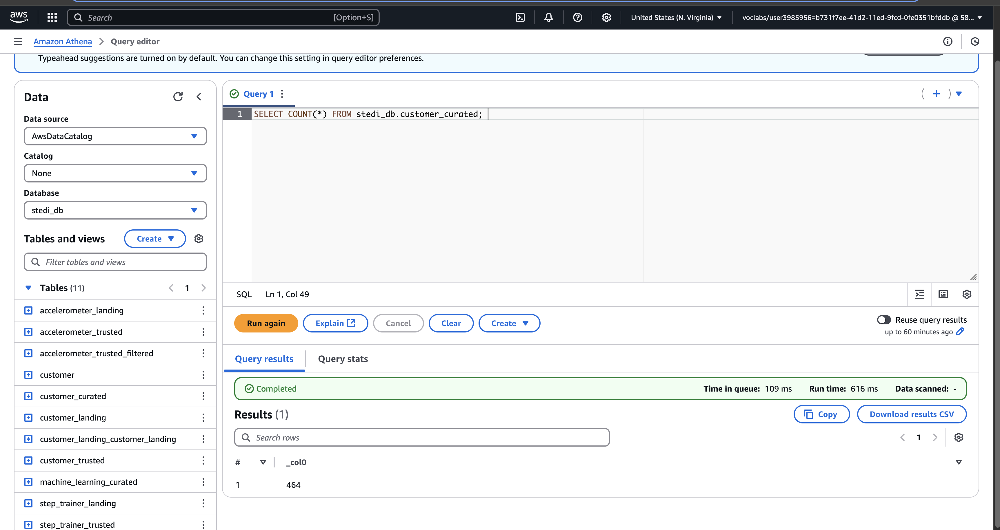
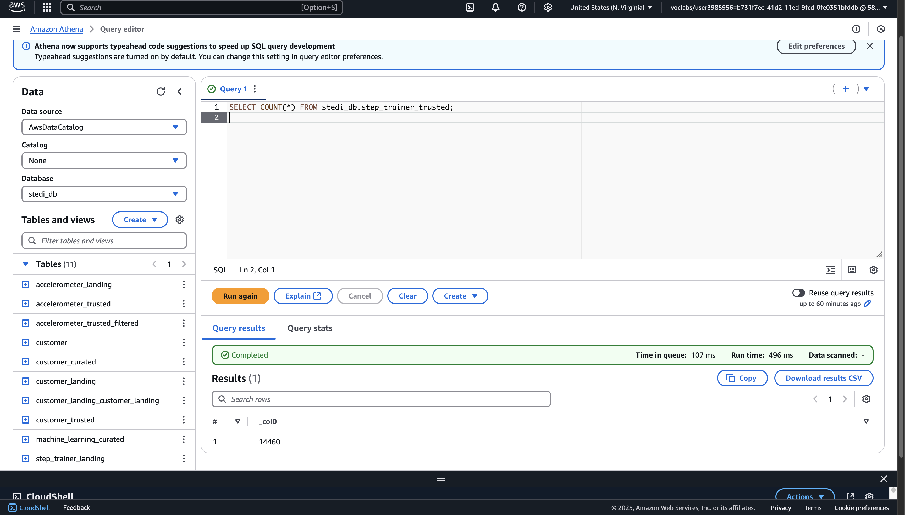
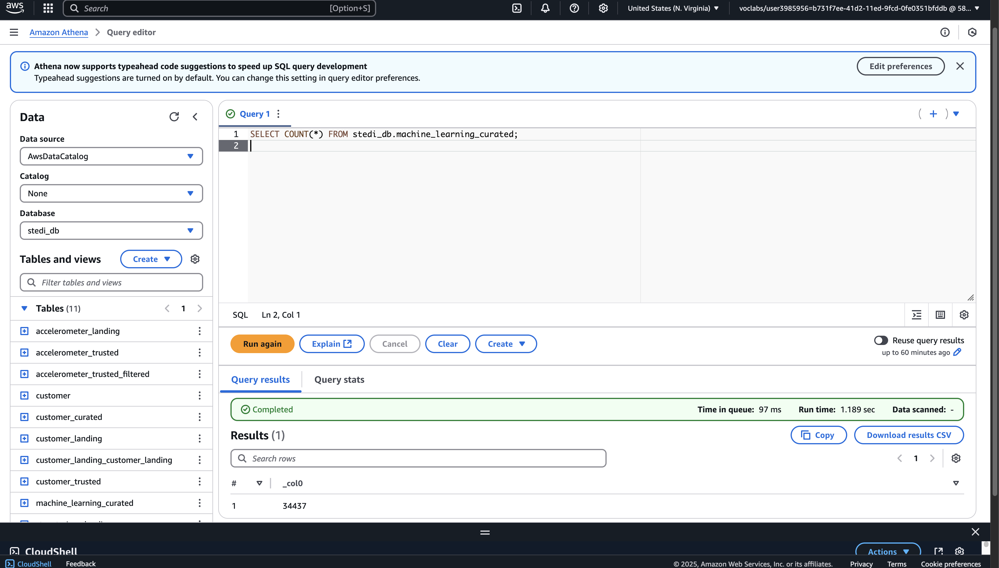

# STEDI Human Balance Analytics - Project Submission

This project simulates ingesting and transforming sensor and customer data using AWS Glue and S3. The final goal is to curate clean and research-consented data for machine learning purposes.

---

## 📂 Project Structure

```
├── README.md
├── sql_scripts/
│   ├── customer_landing.sql
│   ├── accelerometer_landing.sql
│   └── step_trainer_landing.sql
├── screenshots/
│   ├── customer_landing.png
│   ├── accelerometer_landing.png
│   ├── step_trainer_landing.png
│   ├── customer_trusted.png
│   ├── accelerometer_trusted.png
│   ├── customer_curated.png
│   ├── step_trainer_trusted.png
│   └── machine_learning_curated.png
```

---

##  1. Landing Zone

Glue Tables were manually created using the following SQL DDL scripts:

- `customer_landing.sql`
- `accelerometer_landing.sql`
- `step_trainer_landing.sql`

###  Athena Query Results:
- 
- 
- 

Expected row counts:
- Customer Landing: **956** rows
- Accelerometer Landing: **81,273** rows
- Step Trainer Landing: **28,680** rows

---

##  2. Trusted Zone

Glue jobs were created to filter and clean the raw landing data:

### Jobs:
- `customer_landing_to_trusted`
- `accelerometer_landing_to_trusted`

Filtering conditions:
- `shareWithResearchAsOfDate IS NOT NULL`

###  Athena Query Results:
- 
- 

Expected row counts:
- Customer Trusted: **482** rows
- Accelerometer Trusted: **40,981** rows (or ~32,025 depending on filtering)

---

## 📊 3. Curated Zone

### Jobs:
- `customer_trusted_to_curated`
- `step_trainer_trusted`
- `machine_learning_curated`

###  Athena Query Results:
- 
- 
- 

Expected row counts:
- Customer Curated: **464–482** rows
- Step Trainer Trusted: **~57,000** rows
- Machine Learning Curated: **~34,000–46,000** rows

---

## 📝 Notes & Challenges

- Dropping fields in Glue sometimes failed → used **SQL Query Node** instead.
- Job bookmarks were disabled to ensure fresh S3 write on every run.
- Step Trainer join required **Data Catalog source** to load full curated data.
- Used `SELECT DISTINCT` to remove duplicates where needed.

---

##  Final Summary

All required Glue Jobs and Glue Tables were completed successfully. 
Screenshots and SQL scripts are included to validate the process.

---

### Submitted by: Fai Alharbi
### Date: May 2025
